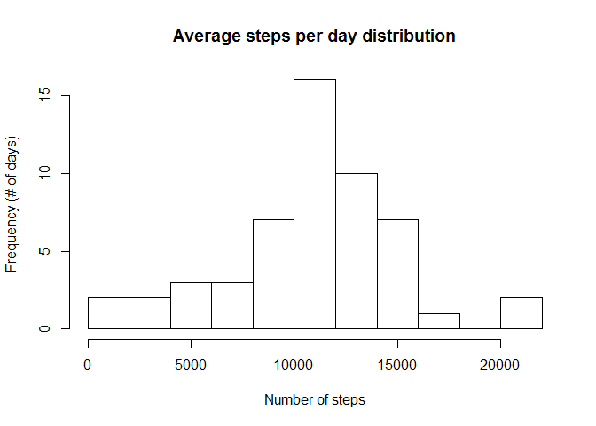
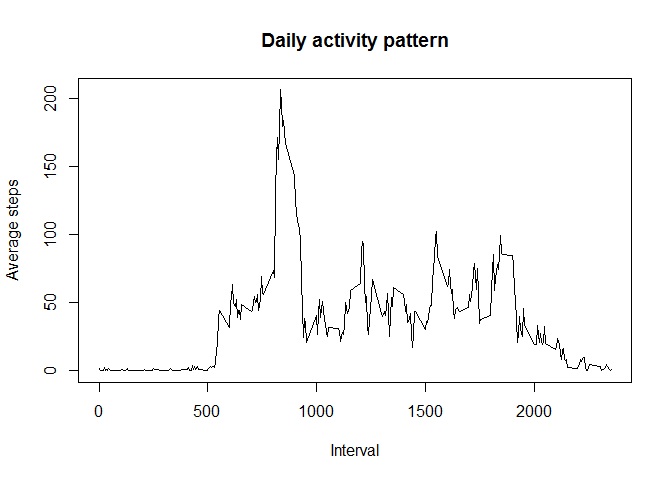
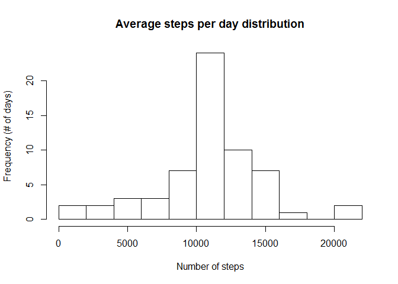
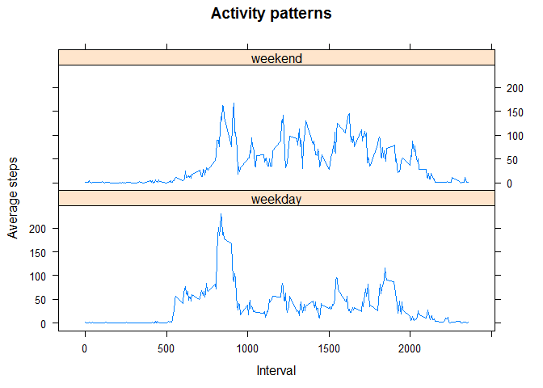

# Reproducible Research: Peer Assessment 1


## Loading and preprocessing the data

The data is provided as a csv file compressed in a zip file, so to load it, the first thing to do is to unzip the file; once it's done we are ready to read it.

In order to deal with the dates, they are transformed to a date type (once the file is read the date is
interpreted as a factor)


```r
unzip('activity.zip')
activity <- read.csv('activity.csv')
activity <- transform(activity, date = as.Date(date, '%Y-%m-%d'))
```


## What is mean total number of steps taken per day?

First we will summarize the number of steps per day


```r
library('dplyr')
```

```
## Warning: package 'dplyr' was built under R version 3.1.3
```

```
## 
## Attaching package: 'dplyr'
## 
## The following object is masked from 'package:stats':
## 
##     filter
## 
## The following objects are masked from 'package:base':
## 
##     intersect, setdiff, setequal, union
```

```r
totalStepsPerDay <- summarize(group_by(activity, date), sum(steps))
names(totalStepsPerDay) <- c('date', 'steps')
```

Now we are ready to check how the steps per day distribution is


```r
hist(totalStepsPerDay$steps, breaks=10, 
     main='Average steps per day distribution', xlab='Number of steps', ylab='Frequency (# of days)')
```

 

Finally calculate the mean and the median


```r
mean(totalStepsPerDay$steps, na.rm=TRUE)
```

```
## [1] 10766.19
```

```r
median(totalStepsPerDay$steps, na.rm=TRUE)
```

```
## [1] 10765
```


## What is the average daily activity pattern?

First we are going to make a time series plot of the 5-minute interval (x-axis) and the average number of steps taken, averaged across all days (y-axis)


```r
stepsPerInterval <- summarize(group_by(activity, interval), mean(steps, na.rm=TRUE))
names(stepsPerInterval) <- c('interval', 'averageSteps')
plot(stepsPerInterval, type='l',
     main='Daily activity pattern', xlab='Interval', ylab='Average steps')
```

 

Which 5-minute interval, on average across all the days in the dataset, contains the maximum number of steps?

It is easy to answer this question:


```r
stepsPerInterval[stepsPerInterval$averageSteps==max(stepsPerInterval$averageSteps), 'interval']
```

```
## Source: local data frame [1 x 1]
## 
##   interval
## 1      835
```


## Imputing missing values

Let's calculate and report the total number of missing values in the dataset (i.e. the total number of rows with NAs)

As a row may have several NAs the way to check how many rows have missing values is:


```r
sum(rowSums(is.na(activity)) > 0)
```

```
## [1] 2304
```

Although in this case all of the NAs are in the 'steps' column:

```r
colSums(is.na(activity))
```

```
##    steps     date interval 
##     2304        0        0
```

Now it is time to fill in NAs values; in order to do so, the strategy to follow will be to use the mean for the corresponding 5-minute interval


```r
intervalMeans <- summarize(group_by(activity, interval), mean(steps, na.rm=TRUE))
names(intervalMeans) <- c('interval', 'intervalMean')
activityNoNA <- inner_join(activity, intervalMeans)
```

```
## Joining by: "interval"
```

```r
activityNoNA[is.na(activityNoNA$steps), 'steps'] <- activityNoNA[is.na(activityNoNA$steps), 'intervalMean']
activityNoNA <- activityNoNA[ , c('steps', 'date', 'interval')]
```

Let's make a histogram of the total number of steps taken each day and Calculate and report the mean and median total number of steps taken per day.


```r
totalStepsPerDayNoNA <- summarize(group_by(activityNoNA, date), sum(steps))
names(totalStepsPerDayNoNA) <- c('date', 'steps')
hist(totalStepsPerDayNoNA$steps, breaks=10, 
     main='Average steps per day distribution', xlab='Number of steps', ylab='Frequency (# of days)')
```

 

```r
mean(totalStepsPerDayNoNA$steps)
```

```
## [1] 10766.19
```

```r
median(totalStepsPerDayNoNA$steps)
```

```
## [1] 10766.19
```


## Are there differences in activity patterns between weekdays and weekends?

First, we will create a new factor variable in the dataset with two levels – “weekday” and “weekend” indicating whether a given date is a weekday or weekend day.


```r
activityNoNA$weekdays <- weekdays(activityNoNA$date)
activityNoNA[activityNoNA$weekdays=='sábado' | activityNoNA$weekdays=='domingo', 'weekdays'] <- 'weekend'
activityNoNA[!activityNoNA$weekdays == 'weekend', 'weekdays'] <- 'weekday'
activityNoNA <- transform(activityNoNA, weekdays = factor(weekdays))
```

Now we will make a panel plot containing a time series plot (i.e. type = "l") of the 5-minute interval (x-axis) and the average number of steps taken, averaged across all weekday days or weekend days (y-axis). 


```r
summarizedActivity <- summarize(group_by(activityNoNA, interval, weekdays), mean(steps))
names(summarizedActivity) <- c('interval', 'weekdays', 'averageSteps')

library(lattice)
```

```
## Warning: package 'lattice' was built under R version 3.1.3
```

```r
xyplot(averageSteps ~ interval | weekdays, data=summarizedActivity,
       type = "l", layout=c(1, 2),
       main='Activity patterns', xlab='Interval', ylab='Average steps')
```

 
